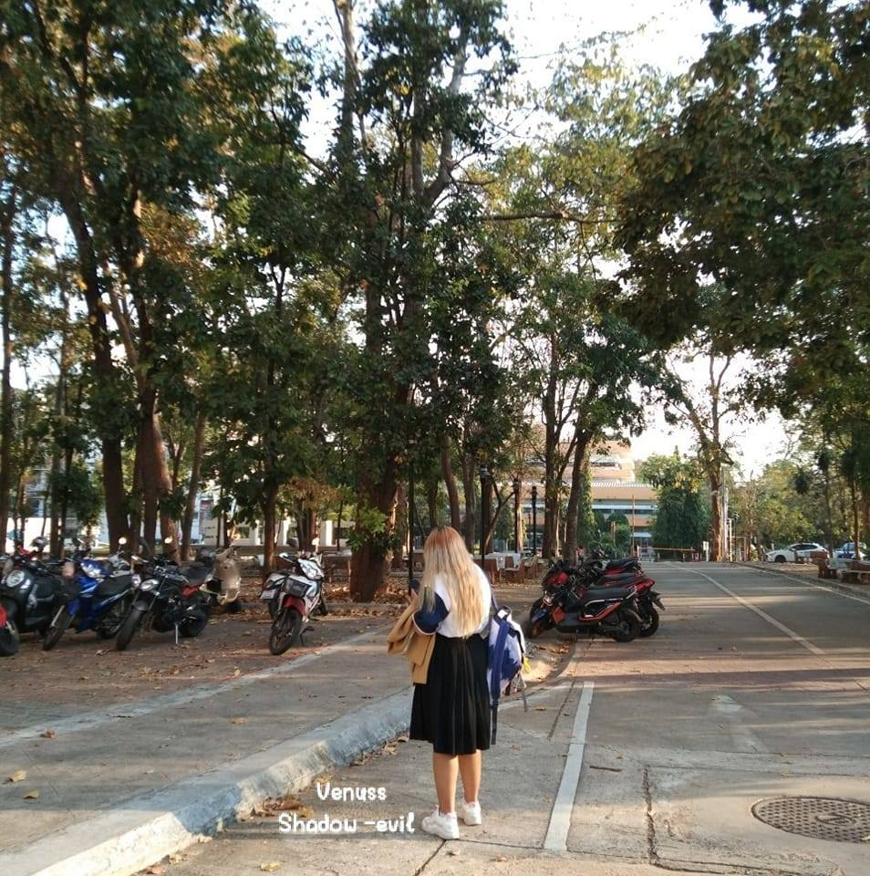

# SOFT_EN_Group

[Working with Collaborators and Remote Repository]

- **ชื่อ-นามสกุล:** Phatcharapohn Samienchai
- **รหัสนักศึกษา:** 643021330-2
- **Section:** 4
- **GitHub Username:** phatcharapohn
- **chapter:** []

---

- **ชื่อ-นามสกุล:** Marisa Pinkaew
- **รหัสนักศึกษา:** 643021429-3
- **Section:** 4
- **GitHub Username:** BamMarisa
- **chapter:** []
 

---

Narisara Khaowkong, 643020617-7, SEC4, tmxgm

---

- **ชื่อ-นามสกุล:** Tham numai
- **รหัสนักศึกษา:** 643021326-3
- **Section:** 4
- **GitHub Username:** tham888
- **chapter:** []
 

---
- **ชื่อ-นามสกุล:** Nuttanon Promthaisong
- **รหัสนักศึกษา:** 643020606-2
- **Section:** 4
- **GitHub Username:** NuttanonCSKKU
- **chapter:** []
 

